# 🏥 DFU App - Sistema de Análise de Pé Diabético

Sistema completo para análise e classificação de lesões em pé diabético utilizando inteligência artificial. O projeto é composto por um aplicativo mobile desenvolvido em React Native (Expo), um backend em Node.js e um servidor Python com modelos de IA para detecção e classificação de lesões.


<div align="center">

  <h3 align="center">🔐 Acesso & Cadastro</h3>
  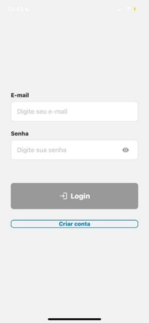
  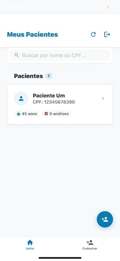
  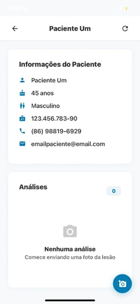<br>

  <h3 align="center">🤖 Fluxo de Análise com IA (Detecção + Classificação)</h3>
  <p><em>O usuário captura a imagem, a IA detecta a lesão (YOLO) e classifica a gravidade (ResNet).</em></p>
  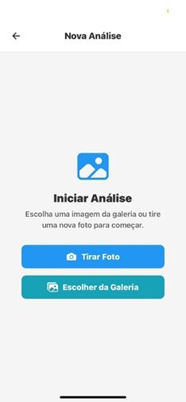
  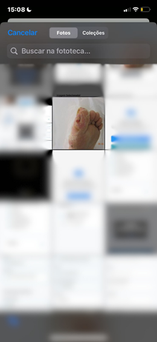
  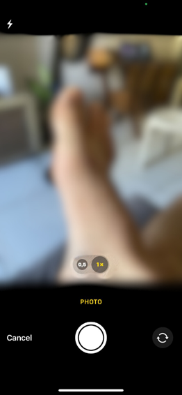
  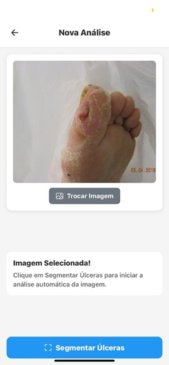
  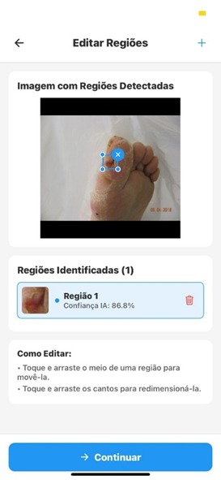
  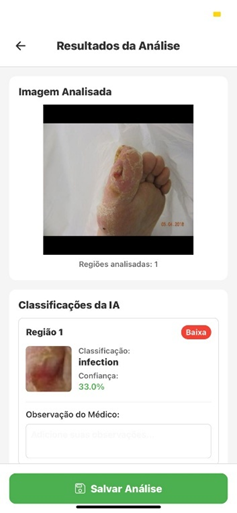
  

  <br><br>

  <h3 align="center">📊 Gestão de Pacientes & Histórico</h3>
  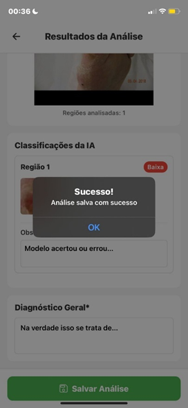
  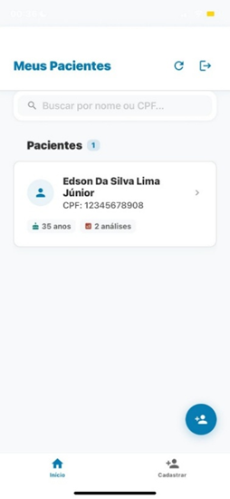
  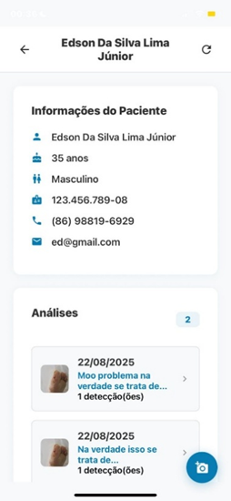
  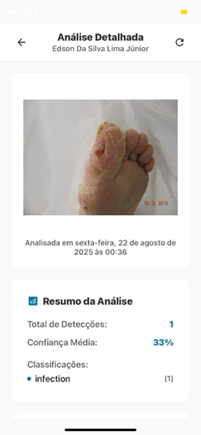
  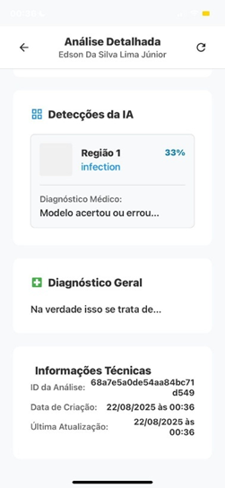


<br>
  <p><em>Fluxo do App: Login → Detecção de Lesão (YOLO) → Diagnóstico (ResNet) → Consulta Posterior </em></p>
  
</div>


## 📋 Índice

- [Sobre o Projeto](#-sobre-o-projeto)
- [Aprendizados e Competências](#-aprendizados-e-competências)
- [Arquitetura](#-arquitetura)
- [Tecnologias](#-tecnologias)
- [Estrutura do Projeto](#-estrutura-do-projeto)
- [Instalação e Configuração](#-instalação-e-configuração)
- [Uso](#-uso)
- [Deploy](#-deploy)
- [Documentação](#-documentação)
- [Contribuindo](#-contribuindo)
- [Licença](#-licença)

## 🎯 Sobre o Projeto

O DFU App é uma solução tecnológica para auxiliar profissionais de saúde na análise e classificação de lesões em pé diabético. para criar utilizei modelos de deep learning (YOLOv5 e ResNet50), o sistema é capaz de:

- 🔍 Detectar regiões de lesão em imagens de pés
- 🎯 Classificar o tipo e gravidade das lesões
- 📊 Gerar relatórios e histórico de análises
- 👤 Gerenciar pacientes e profissionais
- 🔐 Autenticação segura com Firebase

Para informações mais aprofundadas sobre o projeto pode visitar a pasta docs, que contém meu relatório final e o resumo expandido

## 💡 Aprendizados e Competências

Neste projeto, desenvolvi habilidades práticas em:

* **Integração Fullstack:** Como conectar diferentes tecnologias (React Native no mobile, Node.js no backend e Python na IA) através de APIs REST.
* **Treinamento de IA do Zero:** Coleta de dataset, anotação e treinamento de modelos de Visão Computacional.
* **Deploy de Modelos (MLOps):** Como colocar um modelo de IA em produção usando FastAPI para ser consumido por aplicações reais.
* **Infraestrutura em Nuvem:** Configuração de servidores e deploy de microsserviços utilizando a plataforma Railway.
* **Arquitetura de Software:** Organização de um sistema complexo separando responsabilidades entre Frontend, Backend e Microsserviços.

## 🏗️ Arquitetura

O projeto segue uma arquitetura em camadas com três componentes principais:

```
┌─────────────────┐
│   frontDFU      │  ← Aplicativo Mobile (React Native/Expo)
│  (Cliente)      │
└────────┬────────┘
         │
         ↓ HTTP/REST
┌─────────────────┐
│    backDFU      │  ← Backend API (Node.js/Express)
│   (Servidor)    │     • Autenticação
└────────┬────────┘     • Gerenciamento de dados
         │              • Firebase Storage
         ↓ HTTP/REST
┌─────────────────┐
│   server-py     │  ← Servidor de IA (Python/FastAPI)
│  (IA Service)   │     • Detecção YOLOv5
└─────────────────┘     • Classificação ResNet50
```

## 🚀 Tecnologias

### Frontend (frontDFU)
- **React Native** - Framework mobile
- **Expo** - Plataforma de desenvolvimento
- **Firebase Authentication** - Autenticação de usuários
- **Expo Router** - Navegação por arquivos
- **Expo Camera** - Captura de imagens
- **AsyncStorage** - Armazenamento local

### Backend (backDFU)
- **Node.js** - Runtime JavaScript
- **Express** - Framework web
- **MongoDB** - Banco de dados NoSQL
- **Mongoose** - ODM para MongoDB
- **Firebase Admin SDK** - Gerenciamento Firebase server-side
- **JWT** - Autenticação por tokens
- **Multer** - Upload de arquivos
- **Sharp** - Processamento de imagens

### Servidor IA (server-py)
- **Python 3.10+** - Linguagem de programação
- **FastAPI** - Framework web assíncrono
- **PyTorch** - Framework de deep learning
- **TensorFlow/Keras** - Framework de deep learning
- **YOLOv5** - Modelo de detecção de objetos
- **ResNet50** - Modelo de classificação
- **OpenCV** - Processamento de imagens
- **NumPy & Pillow** - Manipulação de dados

## 📁 Estrutura do Projeto

```
AplicativoDFU/
│
├── frontDFU/              # Aplicativo Mobile (React Native + Expo)
│   ├── app/               # Telas e navegação (Expo Router)
│   ├── components/        # Componentes reutilizáveis
│   ├── config/            # Configurações (API, Firebase)
│   ├── hooks/             # Hooks customizados
│   └── utils/             # Utilitários e validações
│
├── backDFU/               # Backend API (Node.js + Express)
│   ├── config/            # Configurações (Firebase)
│   ├── middleware/        # Middlewares (autenticação)
│   ├── models/            # Modelos Mongoose (MongoDB)
│   ├── routes/            # Rotas da API
│   └── index.js           # Arquivo principal
│
├── server-py/             # Servidor de IA (Python + FastAPI)
│   ├── models-ia/         # Modelos treinados
│   │   ├── bestYolov5_test.pt
│   │   └── resnet50_consolidado.keras
│   └── api_ia.py          # API de predição
│
└── docs/                  # Documentação acadêmica do projeto
```

## ⚙️ Instalação e Configuração

### Pré-requisitos

- Node.js 18+ e npm/yarn
- Python 3.10+
- MongoDB (local ou Atlas)
- Conta Firebase
- Git

### 1️⃣ Clonar o Repositório

```bash
git clone https://github.com/seu-usuario/DFU-App.git
cd DFU-App
```

### 2️⃣ Configurar Backend (backDFU)

```bash
cd backDFU

# Instalar dependências
npm install

# Configurar variáveis de ambiente
cp .env.example .env
# Editar .env com suas credenciais

# Iniciar servidor
npm start
```

**Configurações importantes no `.env`:**
- `MONGO_URI`: String de conexão do MongoDB
- `FIREBASE_*`: Credenciais do Firebase Service Account
- `PYTHON_API_BASE_URL`: URL do servidor Python

### 3️⃣ Configurar Servidor IA (server-py)

```bash
cd server-py

# Criar ambiente virtual
python -m venv venv

# Ativar ambiente virtual
# Windows:
venv\Scripts\activate
# Linux/Mac:
source venv/bin/activate

# Instalar dependências
pip install -r requirements.txt

# Configurar variáveis de ambiente
cp .env.example .env

# Iniciar servidor
uvicorn api_ia:app --reload --host 0.0.0.0 --port 8000
```

**Nota:** Os modelos de IA (`.pt` e `.keras`) devem estar na pasta `models-ia/`.

### 4️⃣ Configurar Frontend (frontDFU)

```bash
cd frontDFU

# Instalar dependências
npm install

# Configurar variáveis de ambiente
cp .env.example .env
# Editar .env com suas credenciais Firebase

# Iniciar aplicativo
npx expo start
```

Para executar:
- Pressione `a` para Android
- Pressione `i` para iOS
- Escaneie o QR code com o app Expo Go

##  Uso

### Fluxo de Uso da Aplicação

1. **Cadastro/Login**: Profissional se cadastra/autentica no sistema
2. **Cadastro de Paciente**: Adiciona informações do paciente
3. **Captura de Imagem**: Fotografa o pé do paciente
4. **Análise IA**: Sistema processa a imagem e detecta lesões
5. **Seleção de Regiões**: Profissional seleciona regiões de interesse
6. **Classificação**: IA classifica cada região selecionada
7. **Resultados**: Visualização dos resultados e histórico

### Endpoints Principais

**Backend (backDFU)**
- `POST /api/logup` - Cadastro de usuário
- `POST /api/login` - Login
- `GET /api/profissionais/:id` - Dados do profissional
- `POST /api/pacientes` - Criar paciente
- `GET /api/pacientes/:id` - Buscar paciente
- `POST /api/pacientes/:id/analises` - Criar análise

**Servidor IA (server-py)**
- `POST /predict` - Análise de imagem (detecção + classificação)

## 🚢 Deploy

### Backend (Railway)

```bash
cd backDFU
# Railway detecta automaticamente o arquivo railway.json
railway up
```

### Servidor Python (Railway)

```bash
cd server-py
# O Dockerfile é usado automaticamente
railway up
```

### Frontend (Expo)

```bash
cd frontDFU
# Build para Android
eas build -p android

# Build para iOS
eas build -p ios
```

## 📖 Documentação

A documentação completa do projeto está disponível na pasta [`docs/`](docs/):

- **📄 [Relatório Final](docs/RelatorioFinal_DFU.pdf)** - Relatório final mais detalhadao sobre o projeto
- **🎤 [Banner](docs/BannerDFU.pptx)** - Banner que apresentado no evento SIUFPI 2025


## 🤝 Contribuindo

Contribuições são bem-vindas! Por favor, siga os passos:

1. Fork o projeto
2. Crie uma branch para sua feature (`git checkout -b feature/AmazingFeature`)
3. Commit suas mudanças (`git commit -m 'Add some AmazingFeature'`)
4. Push para a branch (`git push origin feature/AmazingFeature`)
5. Abra um Pull Request

## 📝 Licença

Este projeto está sob a licença MIT. Veja o arquivo `LICENSE` para mais detalhes.

## 👥 Autores

- **Edson da Silva Lima** - *Desenvolvimento inicial* - [edsondasilvalj](https://github.com/edsondasilvalj)


---

⭐ Se gostou desse projeto ou foi útil para você, considere deixar uma estrela!
